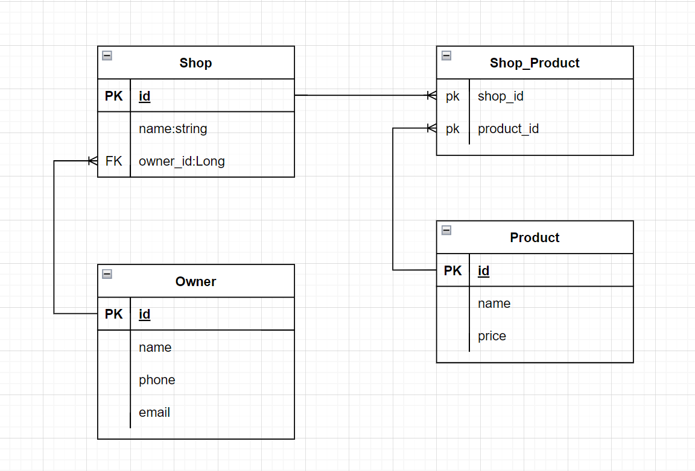

# **Spring Boot: Rest Api + Sping data jpa example**

ORM, MySql, @ManyToMany, @ManyToOne, @OneToMany ...

## Get started

* clone : `git clone https://github.com/BuiQuang26/Spring-data-jpa-example.git`
* build maven: `mvn clean install`
* run jar file: `java -jar /target/spring-data-jpa-0.0.1-SNAPSHOT.jar`
* running port: 8080
* docs api swagger -> http://localhost:8080/swagger-ui.html
## pom.xml

### maven

```xml
<?xml version="1.0" encoding="UTF-8"?>
<project xmlns="http://maven.apache.org/POM/4.0.0" xmlns:xsi="http://www.w3.org/2001/XMLSchema-instance"
         xsi:schemaLocation="http://maven.apache.org/POM/4.0.0 https://maven.apache.org/xsd/maven-4.0.0.xsd">
    <modelVersion>4.0.0</modelVersion>
    <parent>
        <groupId>org.springframework.boot</groupId>
        <artifactId>spring-boot-starter-parent</artifactId>
        <version>2.7.3</version>
        <relativePath/> <!-- lookup parent from repository -->
    </parent>
    <groupId>com.example</groupId>
    <artifactId>spring-data-jpa</artifactId>
    <version>0.0.1-SNAPSHOT</version>
    <name>spring-data-jpa</name>
    <description>Demo project for Spring Boot</description>
    <properties>
        <java.version>17</java.version>
    </properties>
    <dependencies>
        <dependency>
            <groupId>org.springframework.boot</groupId>
            <artifactId>spring-boot-starter-data-jpa</artifactId>
        </dependency>
        <dependency>
            <groupId>org.springframework.boot</groupId>
            <artifactId>spring-boot-starter-web</artifactId>
        </dependency>

        <dependency>
            <groupId>mysql</groupId>
            <artifactId>mysql-connector-java</artifactId>
            <scope>runtime</scope>
        </dependency>
        <dependency>
            <groupId>org.projectlombok</groupId>
            <artifactId>lombok</artifactId>
            <optional>true</optional>
        </dependency>
        <dependency>
            <groupId>org.springframework.boot</groupId>
            <artifactId>spring-boot-starter-test</artifactId>
            <scope>test</scope>
        </dependency>
        <dependency>
            <groupId>org.springdoc</groupId>
            <artifactId>springdoc-openapi-ui</artifactId>
            <version>1.6.11</version>
        </dependency>
    </dependencies>

    <build>
        <plugins>
            <plugin>
                <groupId>org.springframework.boot</groupId>
                <artifactId>spring-boot-maven-plugin</artifactId>
                <configuration>
                    <excludes>
                        <exclude>
                            <groupId>org.projectlombok</groupId>
                            <artifactId>lombok</artifactId>
                        </exclude>
                    </excludes>
                </configuration>
            </plugin>
        </plugins>
    </build>

</project>

```

## Entity

### Model relationship



### Shop

```java
import com.example.springdatajpa.models.Product;

@Entity
@Getter
@Setter
@NoArgsConstructor
@AllArgsConstructor
public class Shop {

    @Id
    @GeneratedValue(strategy = GenerationType.IDENTITY)
    private Long id;

    private String name;

    @ManyToMany
    @JoinTable(
            name = "shop_product",
            joinColumns = {@JoinColumn(name = "shop_id")},
            inverseJoinColumns = {@JoinColumn(name = "product_id")})
    private Set<Product> products = new HashSet<>();

    @ManyToOne(fetch = FetchType.EAGER)
    @JoinColumn(name = "owner_id")
    private Owner owner;

    public void addProduct(Product product){
        this.products.add(product);
    }

    public void removeProduct(Product product){
        this.products.remove(product);
    }
    
}
```

### Product

```java
@Entity
@Getter
@Setter
@AllArgsConstructor
@NoArgsConstructor
public class Product {
    
    @Id
    @GeneratedValue(strategy = GenerationType.IDENTITY)
    private Long id;
    
    private String name;
    
    private Integer price;

    @ManyToMany(mappedBy = "products")
    @JsonIgnore
    private Set<Shop> shops = new HashSet<>();
    
}
```

### Owner

```java
@Entity
@Getter
@Setter
@AllArgsConstructor
@NoArgsConstructor
public class Owner {

    @Id
    @GeneratedValue(strategy = GenerationType.IDENTITY)
    private Long id;
    
    private String name;
    
    private String phone;
    
    private String email;

    @JsonIgnore
    @OneToMany(mappedBy = "owner")
    private List<Shop> shops = new ArrayList<>();
    
}
```

## application.properties

```text
#connect mysql
spring.datasource.url = jdbc:mysql://localhost:3306/jpaTestdb?useSSL=false&serverTimezone=UTC&useLegacyDatetimeCode=false&useUnicode=yes&characterEncoding=UTF-8
spring.datasource.username = root
spring.datasource.password = root

## Hibernate Properties
# The SQL dialect makes Hibernate generate better SQL for the chosen database
spring.jpa.properties.hibernate.dialect = org.hibernate.dialect.MySQL8Dialect
spring.jpa.properties.hibernate.format_sql = true

# = JPA / HIBERNATE
spring.jpa.show-sql=false
spring.jpa.hibernate.ddl-auto=update
spring.jpa.generate-ddl=false
spring.main.allow-bean-definition-overriding=true
```
